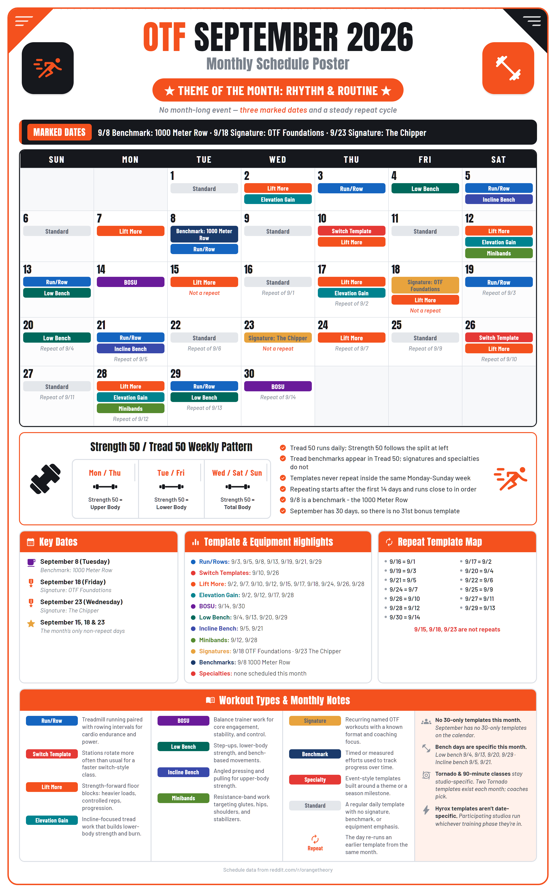

# OTF Schedule Poster

Paste the monthly r/orangetheory thread, get a printable schedule poster.



## Generate a poster

**→ [mnm0720.github.io/otf-schedule-poster](https://mnm0720.github.io/otf-schedule-poster/)**

1. Open the monthly thread on r/orangetheory and copy the entire post
2. Paste it into the text box on the site
3. Hit **Generate** — the poster appears in seconds
4. Download the **PNG** (for printing or sharing) or the **HTML** (opens in any browser)

Everything runs in your browser. Nothing is uploaded, and you don't need an account.

### Fix or customize your poster

After generating, use **Edit your schedule** below the poster. Each day supports
multiple templates, a title for each workout, an earlier **Repeat of** day, and a
**3G template** checkbox. Adding a repeat link leaves the day's templates as you
set them; mismatches appear as warnings when you regenerate.

Under **Poster copy & events**, edit the theme, tagline, subtitle, notes, footnote
headings and text, or event names and date ranges. Notes and footnotes use automatic
copy by default. Turn off **Use automatic copy** to customize the displayed text;
clearing all notes or removing all footnotes restores automatic copy. Events use
day numbers within the displayed month, including a single day or the whole month.

Click **Regenerate poster** to apply your edits. Downloads stay disabled while the
preview is out of date. If an edit is invalid, the draft stays available to fix.
Edits live in this tab only; download the finished poster before closing it.

Use the section links to move between the paste, poster, days, copy, and help.
**Jump to day** takes you directly to a date in the editor. On phones, day cards
and copy fields stack into one column with larger touch controls. **View full size**
lets you scroll across the poster to read its details; **Fit to width** restores
the overview. Both views export the same full-resolution poster.

### What to paste

Copy the whole post — title, prose, links, everything. The generator reads four things
and ignores the rest:

- **Month and theme** — from the title and the "Happy X month!" line
- **Key Dates** — benchmarks, signatures, specialties, and events with their dates
- **Category lists** — which days are Run/Row, Lift More, Switch, etc.
- **Repeat map** — which days re-run an earlier template

Any day that no category mentions becomes **Standard**. Unrecognised category names
are flagged in the output rather than silently dropped.

A plain day-list format (`9/1 - Standard`, `9/2 - Lift More + Elevation Gain`) also
works and is detected automatically.

### Optional fields

- **Month** — normally read from the text; override if detection fails
- **Theme** — same; type your own if you want to change the poster's theme line
- **Tagline** — a subtitle under the theme (e.g. "Three marked dates and a steady repeat cycle")

### Example posts

The site ships with built-in examples (Oct 2025, Apr 2026, Aug 2026, Sep 2026) so
you can see what the output looks like before you paste anything.

## How the poster is laid out

Each poster includes:

| Section | What it shows |
| --- | --- |
| **Header** | Month, year, theme of the month |
| **Calendar** | Color-coded pills for each day's template types |
| **Marked Dates ribbon** | Benchmarks, signatures, and specialties at a glance |
| **Strength 50 / Tread 50 split** | The weekly body-part rotation and key notes |
| **Key Dates panel** | Date, name, and type of each special workout |
| **Template Highlights** | Which days each template type lands on |
| **Repeat Map** | Which days re-run an earlier template |
| **Legend** | What each color means, plus monthly notes |

## Template types the poster knows

| Template | Color | What it is |
| --- | --- | --- |
| Run/Row | Blue | Treadmill + rowing intervals |
| Switch Template | Red | Stations rotate faster than usual |
| Lift More | Orange | Heavier loads, controlled reps |
| Elevation Gain | Teal | Incline-focused tread work |
| BOSU | Purple | Balance trainer work |
| Low Bench | Dark teal | Step-ups, bench-based movements |
| Incline Bench | Indigo | Angled pressing and pulling |
| Minibands | Green | Resistance-band work |
| Signature | Gold | Recurring named workouts (Inferno, Everest, etc.) |
| Benchmark | Navy | Timed efforts (1000m Row, 12 Min Run, etc.) |
| Specialty | Red | Event-style templates (Hell Week, PSL, etc.) |
| Standard | Grey | A regular daily template |

Adding a new template type is one entry in `otfposter/categories.py` — color, blurb,
and the spellings to accept. The pill color, highlights row, and legend all follow
automatically.

## GitHub Actions

If you have write access to the repo: **Actions → Build poster → Run workflow**, paste
the thread into the `schedule_text` box, and run. The poster is attached as a run
artifact.

---

<details>
<summary><strong>Developer setup</strong></summary>

```bash
pip install -e ".[dev]" && python -m playwright install chromium
```

### Commands

| Command | What it does |
| --- | --- |
| `build <file>` | Parse a paste and render the poster |
| `parse <file>` | Paste → `schedules/YYYY-MM.json` only |
| `render [json…]` | Schedule JSON → HTML + PNG |
| `validate [json…]` | Check schedules without rendering |
| `fetch-assets` | Refresh cached icons and fonts under `assets/` |

Useful flags: `--strict`, `--offline`, `--html-only`, `--scale N`, `--theme`, `--tagline`, `--out DIR`.

### Editing after parsing

The parse is a starting point. Edit `schedules/YYYY-MM.json` and re-render:

```bash
python -m otfposter render --month 2026-09
```

The JSON also carries poster copy — `theme`, `tagline`, `notes`, `footnotes`,
`strength_split`, `events`. Leave them out and sensible values are derived from
the schedule.

### Architecture

```
monthly thread ──▶ thread.py ──┐
                               ├──▶ Month (schedules/*.json) ──▶ derive.py ──▶ poster.html.j2 ──▶ PNG
day list      ──▶ parse.py  ───┘         │                          │
                                    validate.py          highlights, repeat map,
                                                      key dates, legend, notes
```

### How the site works

The browser site runs the *actual* Python package via [Pyodide](https://pyodide.org/).
`scripts/build_site.py` bundles the same `.py` files and Jinja template that CI uses —
no JavaScript reimplementation that could drift. Verified byte-for-byte: for all four
months in `schedules/raw/`, the browser produces the same HTML as the command line.

The editor keeps a separate `Month.to_dict()` draft in memory. `web/bridge.py`
reconstructs it with `Month.from_dict()` for regeneration without reparsing.
Category choices come from the Python registry. Automatic copy remains derived
from the edited schedule; custom fields preserve the model's existing semantics.

### Specifications and tests

The [browser editor spec](specs/browser-editor.md) records the behavior and TDD
verification. For behavior changes, add a failing regression test first, implement
the smallest fix, then run the relevant tests and the full checks before delivery:

```bash
python -m pytest -q
node --test tests/editor.test.cjs tests/editor-ui.test.cjs tests/app.test.cjs
python -m otfposter validate
python scripts/build_site.py
```

The JavaScript suite uses Node 22+ and no extra packages. It exercises state, form
handlers, and application flow with a minimal DOM adapter and a mocked runtime.
Python tests exercise the actual bridge, model, and HTML renderer. These checks do
not replace real-browser layout, Pyodide startup, or PNG export testing.

</details>

## Licence

MIT — see [LICENSE](LICENSE). Anton and Barlow are used under the SIL Open Font
License; Material Symbols under Apache 2.0.

Schedule data comes from the monthly threads on
[r/orangetheory](https://www.reddit.com/r/orangetheory/). This is an unofficial
fan tool, not affiliated with Orangetheory Fitness.
