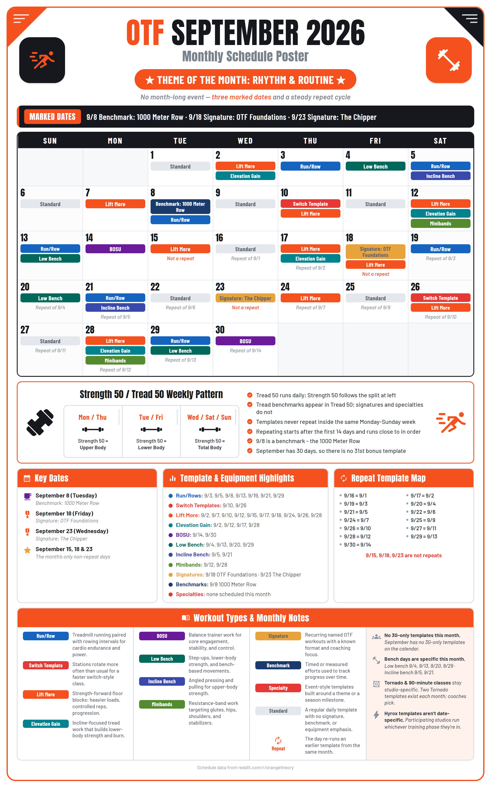

# OTF Schedule Poster

Paste the monthly r/orangetheory thread, get a printable schedule poster.



## Generate a poster

**→ [mnm0720.github.io/otf-schedule-poster](https://mnm0720.github.io/otf-schedule-poster/)**

1. Open the monthly thread on r/orangetheory and copy the entire post
2. Paste it into the text box on the site
3. Select **Generate poster**, then check the detected month and dates
4. Correct anything needed and select **Update preview**
5. Pick a format from the dropdown: **PNG (Recommended)**, HTML, Printable PDF,
   Phone wallpaper, Social calendar, or Calendar file — and hit **Download**

Everything runs in your browser. Nothing is uploaded, and you don't need an account.
The editor shows loading progress on first use. If loading fails, use **Retry
loading**; your pasted text stays in place.

### Fix or customize your poster

After generating, the text inputs are hidden and Generate is disabled. Use
**2. Review and edit** to check the schedule before downloading. **Original thread
and import review** keeps your source available for reference. Optional appearance
sections start collapsed; open only what you want to change.

In **Edit your schedule**, **Select date**
shows one day at a time; **Previous** and **Next** move between dates and keep your
edits. **Review all dates** shows a compact list of workouts, edited dates, inferred
Standard days, and issues. Select a row to edit that date. Each day supports
multiple templates, a title for each workout, an earlier **Repeat of** day, and a
**3G template** checkbox. Adding a repeat link leaves the day's templates as you
set them; mismatches appear as warnings when you update the preview. A repeat link
records a relationship and does not copy or synchronize workouts.

Warnings ask you to review the result. Blocking errors keep every finished download
unavailable until corrected and applied with **Update preview**. Use the action
beside an issue to reach the affected date or control. Your editable draft and
**Download draft** backup remain available.

**Poster title & theme** contains separate fields for theme, tagline, and subtitle.

Under **Key Dates**, choose an entry by its description or select **Add key date**.
New entries start with a default description and the selected schedule date. Link an
entry to one date, several dates, or a range using day numbers such as `8, 18, 24-28`.
Use the visual icon picker and color control for each entry. Unedited fields continue
to follow the schedule; hide an automatic entry or reset linked entries when needed.

Under **Workout Types**, all workout types have a legend toggle and
color picker. Types used in the month are selected automatically until you override
them. Changing a color updates calendar pills, highlights, the legend, and linked
Key Date icons without an individual color override. Highlights always derive from
the schedule. **Use automatic selections** restores the month-based toggles;
**Reset type colors** restores the original palette.

**Strength & Tread 50 notes**, **Monthly notes**, and **Events** each have their own
collapsed section. Edit reminders, callout headings and text, or event names and date
ranges. Choose icons and colors for the reminders and each monthly note. Notes use automatic
copy by default. Turn off **Use automatic copy** to customize the displayed text;
clearing all notes or removing all footnotes restores automatic copy. Events use
day numbers within the displayed month, including a single day or the whole month.

**Additional info** and **Credits & team** are the last two sections. Additional info
accepts multiline text and appears below the other poster sections only when filled
in. Credits default to the image and Modsquad attribution, with Reddit usernames
linked to their profiles in the HTML poster. Edit or clear the credit text as needed;
**Restore default credits** brings the original attribution back.

Click **Update preview** to apply your edits. The **Download** button stays
disabled while the preview is out of date; draft backups and editable sharing still
include pending edits. If an edit is invalid, the draft stays available to fix.
Edits save automatically in this browser, even before updating the preview. The
visible save status reports **Saved in this browser** or a failure requiring a
backup. After reopening, the last active draft is restored. An unfinished paste is
also saved when browser storage is available.

**Previous version** and **Next version** appear under **Earlier versions and recovery** and step
through saved editing checkpoints. Changes made since the last preview update are
preserved as a recoverable version before navigation. Returning to pending edits
keeps the last good preview visible until you update it. Failed rendering preserves
the draft and history. A successful update after navigating back starts a new
branch; the app retains up to 100 snapshots in each history direction.

To start over, select **Restart from text** beside the disabled Generate button.
The popup explains that this clears the current editing session while retaining
saved drafts. If autosave is unavailable, it warns you to download a backup first.
**Keep editing** cancels; **Restart from text** restores the original paste and lets
you generate a separate fresh poster. If a previously working save fails during
restart, the editor stays open so you can back up your changes.

Use **1. Paste**, **2. Edit**, **3. Download**, and **Help** to navigate. On phones,
day cards and copy fields stack into one column with larger touch controls. **View full size**
lets you scroll across the poster to read its details; **Fit to width** restores
the overview. Both views export the same full-resolution poster.

### Save and share editable drafts

Your poster saves automatically as a draft. Open **Save, back up or share** to give
it a name, back it up, or send an editable copy. It
appears in the **Saved Drafts** dialog. Open the dialog from the button above the
text box to load, download, delete, or import drafts. A toast confirms when a draft
is loaded. Saved Drafts remains available so you can switch again. A failed load or
import keeps your current poster and the picker available for retry. If your
current work cannot be saved, download a backup before switching.

**Download draft** in the editor saves your current work as an editable JSON file,
including pending edits and history. Use **Import draft file** in the Saved Drafts
dialog on another device. Browser storage can be cleared or run out of space: the
page reports failures and preserves the draft for download.

**Share editable copy** creates a compressed snapshot link. Send it to another mod;
it opens as a separate local draft without replacing existing saved drafts. After
editing, send a new link or JSON file back. **Copies do not synchronize live.** This
workflow runs entirely on GitHub Pages, with no accounts, database, or uploads.
Links include current edits and the last rendered schedule, but omit the original
paste and undo history. Draft files include both. If a snapshot is too large for a
reliable URL, use a draft file instead.

### Export formats

All formats are in the same dropdown — pick one and hit **Download**:

| Format | What you get |
| --- | --- |
| **PNG (Recommended)** | Full poster as a high-resolution image |
| **HTML** | The poster as a standalone web page |
| **Printable PDF (A4)** | The full poster scaled to fit a single A4 page |
| **Phone wallpaper** | 1080 × 1920 calendar and workout color key |
| **Social calendar** | 1080 × 1350 calendar and workout color key |
| **Calendar file (.ics)** | Daily all-day workouts and monthly events |

Compact images include attribution; use the full poster or PDF for detailed notes.
Calendar entries are schedule dates, not studio class times. The last downloaded
file also has an Open link for viewing or saving manually.

### What to paste

Copy the whole post — title, prose, links, everything. The generator reads four things
and ignores the rest:

- **Month and theme** — from the title and the "Happy X month!" line
- **Key Dates** — benchmarks, signatures, specialties, and events with their dates
- **Category lists** — which days are Run/Row, Lift More, Switch, etc.
- **Repeat map** — which days re-run an earlier template

Inclusive date ranges such as `9/3-9/5` include all three days. Invalid dates and
recognizable schedule lines that could not be understood appear in the import
review. Unrelated prose can be ignored safely.

Any day that no category mentions becomes **Standard** and is marked as inferred
in the review list. Unrecognised category names
are kept on their dates as custom workout types with distinct colors. They appear
in template selectors, Workout Types, highlights, and the poster. Check spelling;
if the type is new, let the developer know. Change its color like any other type.

A plain day-list format (`9/1 - Standard`, `9/2 - Lift More + Elevation Gain`) also
works and is detected automatically.

### Month override

The month is normally read from the text. Use the optional **Month** picker before
generating if detection fails. Check the month shown above the editor; use **Restart
from text** to choose another month and generate a new draft. After generating,
change theme, tagline, and subtitle
under **Poster title & theme**.

### Example posts

The site ships with built-in examples (Oct 2025, Apr 2026, Aug 2026, Sep 2026) so
you can see what the output looks like before you paste anything.

## How the poster is laid out

Each poster includes:

| Section | What it shows |
| --- | --- |
| **Header** | Month, year, theme of the month |
| **Calendar** | Color-coded pills for each day's template types |
| **Marked Dates ribbon** | Benchmarks, signatures, and specialties at a glance |
| **Strength 50 / Tread 50 split** | The weekly body-part rotation and key notes |
| **Key Dates panel** | Date, name, and type of each special workout |
| **Template Highlights** | Which days each template type lands on |
| **Repeat Map** | Which days re-run an earlier template |
| **Legend** | What each color means, plus monthly notes |
| **Events** | Ribbons for events with their date ranges, when present |
| **Additional info** | Optional free text below the other sections; hidden when empty |
| **Credits & team** | Editable image and Modsquad attribution; hidden when cleared |

## Template types the poster knows

| Template | Color | What it is |
| --- | --- | --- |
| Run/Row | Blue | Treadmill + rowing intervals |
| Switch Template | Red | Stations rotate faster than usual |
| Lift More | Orange | Heavier loads, controlled reps |
| Elevation Gain | Teal | Incline-focused tread work |
| BOSU | Purple | Balance trainer work |
| Low Bench | Dark teal | Step-ups, bench-based movements |
| Incline Bench | Indigo | Angled pressing and pulling |
| Minibands | Green | Resistance-band work |
| Signature | Gold | Recurring named workouts (Inferno, Everest, etc.) |
| Benchmark | Navy | Timed efforts (1000m Row, 12 Min Run, etc.) |
| Specialty | Red | Event-style templates (Hell Week, PSL, etc.) |
| Standard | Grey | A regular daily template |

Unknown types are added automatically to that month's editable workout types.
To make a type a built-in default for every month, add an entry in
`otfposter/categories.py` with its color, blurb, and accepted spellings. The pill
color, highlights row, and legend follow automatically.

## GitHub Actions

If you have write access to the repo: **Actions → Build poster → Run workflow**, paste
the thread into the `schedule_text` box, and run. The poster is attached as a run
artifact.

---

<details>
<summary><strong>Developer setup</strong></summary>

For the same dependency versions used by CI and Pages:

```bash
python -m pip install -r requirements-pages.lock
python -m pip install --no-deps --no-build-isolation -e .
python -m playwright install chromium
```

Use Python 3.10+ and Node 22+. `requirements-pages.lock` pins the release and test
dependencies, including Playwright; browser runtime libraries have separate pinned
URLs in `web/runtime.js` and `web/runtime-worker.js`.

### Commands

| Command | What it does |
| --- | --- |
| `build <file>` | Parse a paste and render the poster |
| `parse <file>` | Paste → `schedules/YYYY-MM.json` only |
| `render [json…]` | Schedule JSON → HTML + PNG |
| `validate [json…]` | Check schedules without rendering |
| `fetch-assets` | Refresh cached icons and fonts under `assets/` |

Useful flags: `--strict`, `--offline`, `--html-only`, `--scale N`, `--theme`, `--tagline`, `--out DIR`.

### Editing after parsing

The parse is a starting point. Edit `schedules/YYYY-MM.json` and re-render:

```bash
python -m otfposter render --month 2026-09
```

The JSON also carries poster copy: `theme`, `tagline`, `subtitle`, `notes`,
`footnotes`, `strength_split`, `events`, `additional_info`, and `credits`.
Missing fields receive defaults; empty notes/footnotes request automatic copy.
Empty additional info and explicitly empty credits hide those sections. Linked
Key Dates, style overrides, and custom workout types also travel with the JSON;
see the [customization data contract](specs/poster-customization.md#data-contract).

### Architecture

```
monthly thread / day list → thread.py / parse.py → Month JSON → validate.py
                                                    │
                              derive.py → render.py → full poster HTML
                                                    → PNG / PDF in the browser
                              exports.py → compact HTML → phone / social PNG
                                         → all-day calendar (.ics)
```

### How the site works

The browser site runs the actual Python package via [Pyodide](https://pyodide.org/)
in a Web Worker. `web/runtime.js` provides the main-thread request/response client;
`web/runtime-worker.js` loads pinned Pyodide 0.26.2 and its included Jinja2 package.
The Python bundle fetch overlaps runtime initialization. Parsing and rendering
stay off the editor's main thread, while preview DOM and image export remain there.
Startup progress, bounded waits, and retry preserve the user's draft. Image export
support loads when an image or PDF is requested; PDF support loads only for PDF.

`scripts/build_site.py` bundles Python modules, Jinja templates, and cached assets.
It requires complete local fonts and icons, inlines the fonts, and fingerprints
the JavaScript, CSS, worker, and `bundle.<hash>.json`. `asset-manifest.json` records
the filenames; the HTML embeds relative worker/bundle URLs and the bridge protocol
version. Everything works under a GitHub project-site path. Edit `web/`, not the
ignored generated `site/` directory. The browser and command line share the
full-poster renderer; bridge tests check HTML parity without duplicating parsing.

`web/editor-state.js` keeps the editable draft, last rendered schedule, initial
reset baseline, and undo/redo history. `web/workspace.js` handles versioned local
storage and compressed snapshot links; `web/app.js` connects them to the forms,
autosave, and exports. `web/bridge.py` reconstructs `Month.from_dict()` for
regeneration without reparsing. Category choices combine Python's built-in registry
with the month's `custom_categories`. Automatic copy derives from the edited schedule.

Month schema version 2 and workspace envelope version 1 are separate contracts.
Older schedule JSON is migrated; unsupported newer data is rejected and retained
for backup. See [saved workspaces](specs/saved-workspaces.md#data-and-recovery-contract)
for storage, reset, and sharing details. GitHub Pages serves static files only;
editable links transfer snapshots and do not provide live synchronization.

### Specifications and tests

The [browser editor spec](specs/browser-editor.md),
[poster customization spec](specs/poster-customization.md),
[saved workspaces spec](specs/saved-workspaces.md),
[import review spec](specs/import-review.md), and
[GitHub Pages spec](specs/github-pages.md) record behavior and TDD
verification. For behavior changes, update the relevant spec, add a failing regression test first, implement
the smallest fix, then run the relevant tests and the full checks before delivery:

```bash
python -m pytest -q
node --test tests/*.test.cjs
python -m otfposter validate
python scripts/build_site.py
```

The JavaScript suite uses Node 22+ and no extra packages. It exercises state, form
handlers, application flow, storage failures, history, snapshot sharing, worker
transport, lazy loading, and PDF output with a minimal DOM adapter and a mocked
runtime. Python tests exercise
the actual bridge, model, HTML renderers, custom workout types, and ICS output.
These checks do not replace real-browser layout, Pyodide startup, or downloaded
export inspection. Current implementation evidence and remaining verification
limits are recorded in the specifications rather than fixed test counts here.

CI and the Pages build also run the actual built-site smoke check:

```bash
python scripts/smoke_site.py --site site
```

It serves the output under `/otf-schedule-poster/` and uses a temporary Chromium
profile. It checks real Pyodide startup and retry, edit/update, pending draft
restoration, 320/390/768/1440px layouts, image/PDF downloads, and axe accessibility
rules for editor controls. Poster artwork is excluded from axe. It reports
headless CI startup/generation timings; those are not phone or production-network
benchmarks. Adding the workflow does not imply it has already run or published.

For a manual local accessibility check, build with the `--audit` option, serve
`site/` over HTTP, and open `audit.html`:

```bash
python scripts/build_site.py --audit
```

Its width selector and
**Run editor accessibility check** button inspect the embedded editor. A normal
build removes this development-only page. Also review keyboard focus, 200% zoom,
and actual downloaded output; automated checks do not establish full accessibility.

</details>

## Licence

MIT — see [LICENSE](LICENSE). Anton and Barlow are used under the SIL Open Font
License; Material Symbols under Apache 2.0.

Schedule data comes from the monthly threads on
[r/orangetheory](https://www.reddit.com/r/orangetheory/). This is an unofficial
fan tool, not affiliated with Orangetheory Fitness.
